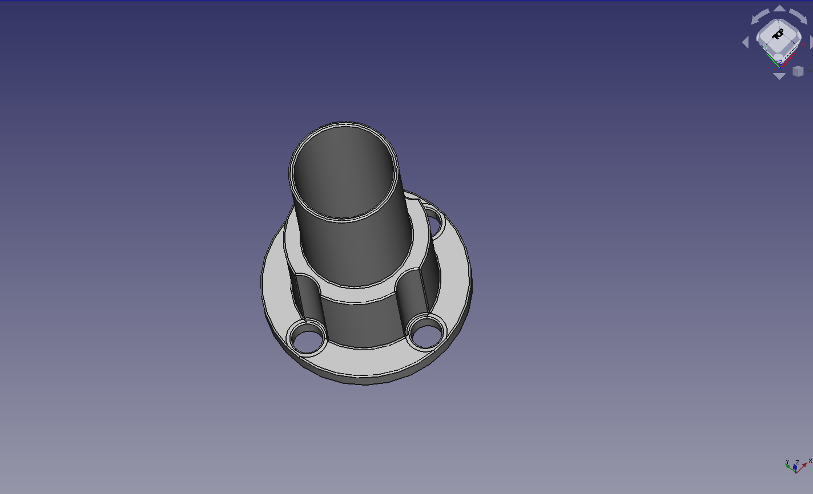
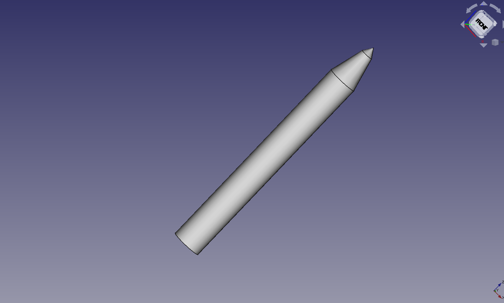
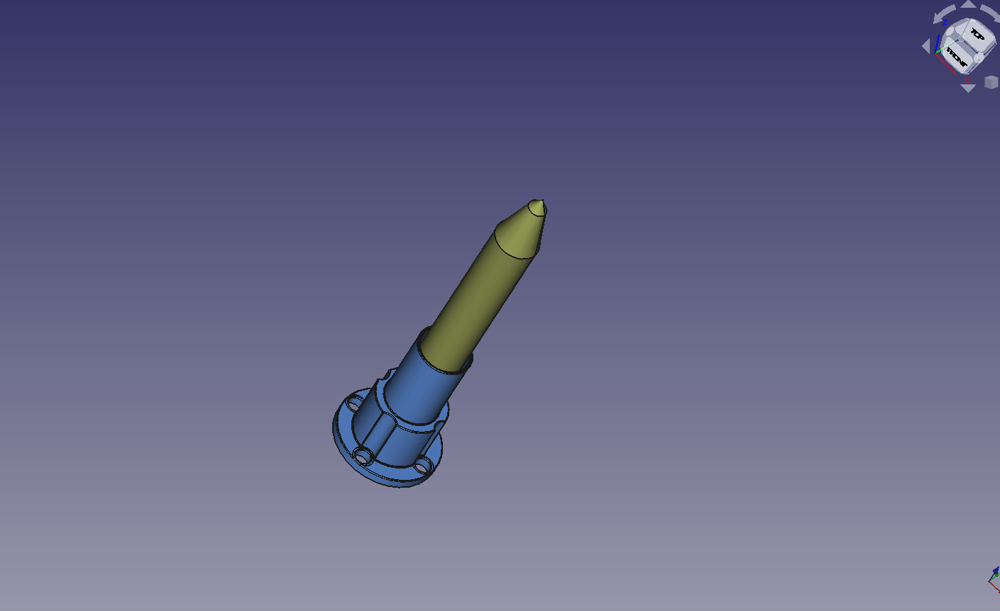

# Robotik Project
# Drawbotics

  Group 1
* Jona Klapp (INF105326)			
* Chien-Hsun, Chao (ITE104218)

22, May 2021

# Table of Contents
<!-- vscode-markdown-toc -->
* 1. [Abstract](#Abstract)
* 2. [The procedure of starting the Drawbotics](#TheprocedureofstartingtheDrawbotics)
	* 2.1. [The laboratory setup](#Thelaboratorysetup)
	* 2.2. [Connection between web application and RoboDk](#ConnectionbetweenwebapplicationandRoboDk)
		* 2.2.1. [Window version](#Windowversion)
		* 2.2.2. [Linux version](#Linuxversion)
	* 2.3. [The configuration of simulated KuKa](#TheconfigurationofsimulatedKuKa)
	* 2.4. [The configuration of real KuKa](#TheconfigurationofrealKuKa)
	* 2.5. [Configuration variables](#Configurationvariables)
* 3. [Project Approach](#ProjectApproach)
	* 3.1. [Base goal](#Basegoal)
		* 3.1.1. [Web application](#Webapplication)
		* 3.1.2. [Coordinates to SVG](#CoordinatestoSVG)
		* 3.1.3. [Enviroment setting of simulator RoboDk](#EnviromentsettingofsimulatorRoboDk)
		* 3.1.4. [Analyze and Optimize Robot movement](#AnalyzeandOptimizeRobotmovement)
		* 3.1.5. [Lines and Arcs](#LinesandArcs)
		* 3.1.6. [Blended movement](#Blendedmovement)
	* 3.2. [Additional Goal](#AdditionalGoal)
		* 3.2.1. [Model a tool](#Modelatool)
		* 3.2.2. [Calligraphic Movements](#CalligraphicMovements)
* 4. [Timing & Project management](#TimingProjectmanagement)
* 5. [Result](#Result)
	* 5.1. [Error 1](#Error1)
	* 5.2. [Error 2](#Error2)
	* 5.3. [Error 3](#Error3)
* 6. [Reference](#Reference)

<!-- vscode-markdown-toc-config
	numbering=true
	autoSave=true
	/vscode-markdown-toc-config -->
<!-- /vscode-markdown-toc -->

##  1. Abstract
This project aims to simulate the user-defined images on the RoboDK and forward the movement commands
 to the real robot "Kuka KR 6 R900 Sixx". There are several main goals to complete:
1. Create a simple "industry 4.0" web application for the end-users.
2. Analyze, converts and optimize user input regarding robotics movement.
3. Setting up enviroment for simulator in RoboDK
4. Analyze and Optimize Robot movement
5. Use lines and arcs to draw picture.
6. Use blended movement for greater speed.

##  2. The procedure of starting the Drawbotics

###  2.1. The laboratory setup 

To allow the real KuKa robot and the simulator RoboDk to run synchronized, the internet connection should be both connected to the laboratory internet. 
By the procedure of setting, there are few steps which mentioned below: 

1. Network internet setting -> change adapter options 
2. Right-click on "Network cable" and click on "Properties" 
3. Go into the "properties" of the "Internet protocol (TCP/IPv4)".
4. Given the specific Ip address which is used for the laboratory.
   * IP Address: 192.168.1.11
   * Subnet mask: 255.255.255.0

###  2.2. Connection between web application and RoboDk 

In order to start up the simulator from Python script, we have to set up a path and configuration for RoboDk and Python script.
There are two versions depends on the individual computer:

####  2.2.1. Window version

Start with checking out the git repository and changing all required variables in the configuration file. 
There are two commands for setting up configuration for RoboDK and python script. 
Input these commands from command prompts:  

1. set PYTHONPATH = < your_python_path >  e.g: D:/Robotic/RoboDK/Python37/python.exe
2. python   < python_script >  e.g: D:/github/FHWedel_Robodk_Group_1/webtest/main.py

####  2.2.2. Linux version 

Start with checking out the git repository and changing all required variables in the configuration file. 
There are two commands for setting up configuration for RoboDK and python script. 
Input these commands from command prompts:  

1. <path_to_RoboDK>/bin/start-w-dependency.sh &	  e.g.: ~/RoboDK/bin/start-w-dependency.sh &
2. python   < python_script >  e.g.: ~/Github/FHWedel_Robodk_Group_1/webtest/main.py

###  2.3. The configuration of simulated KuKa 

Subsequently connecting to the internet of Laboratory, the IP address of the Kuka robot inside the RoboDK has to be altered to the same IP address of the real KuKa robot in the Laboratory. 
1. In RoboDK, right-click on the item "Kuka KR 6 R900 Sixx" -> select "Connerc to robot".
2. There is a configuration setting that appears on the left side of the screen, and you can see a blank to change the IP address of the real robot.
   * Robot IP/ COM: 192.168.1.15
3. Press "connect".  

Not only setting up the configuration manually but there are also some codes that were added into our python-script which could activate the simulated robot into "RUN-MODE".
Take [manual of RoboDk API](https://robodk.com/doc/en/PythonAPI/robolink.html?highlight=runmode#robolink.Robolink.setRunMode) as a reference, we obtained that the run mode for the robot can be changed into "RUNMODE_RUN_ROBOT=6", which moves the real robot from the PC (PC is the client, the robot behaves like a server).

`Robolink().setRunMode(RUNMODE_RUN_ROBOT)`

After doing those steps, the real robot and the simulator RoboDK both are ready to run.  

###  2.4. The configuration of real KuKa  

The real KuKa robot has to be set up into a ready mode which allows it to synchronized move as the simulated robot.
A control panel to manipulate KuKa robot, several steps below:
1. Select a folder called "RoboDKsync32" which is inside of the "Program" folder.
2. Before we run into the synchronized mode, we have to check into the value of the joint speed of the robot. It must not higher than 10 to avoid some items being crashed in the Laboratory or the robot ran into unpredictable circumstances.
3. Afterwards, Double click on the button " > " which is on the control panel. It lets the robot run into certain loops to ready for testing.   

###  2.5. Configuration variables

All required configuration variables are collected in the file "config.py" residing in the main directory of the project.

1. MM_X_PIXEL: This option defines a ratio between pixels as seen on screen to millimeters of movement on the robot. A larger number will result in a bigger drawing.
2. SIZE_BOARD: This option defines the maximal boardsize. The first number is horizontal size, the second number is vertical.
3. DRAWINGPROJECT_PATH: The unique path to the RoboDK RDK file that should be used. A working variant is included via the DrawingProject.rdk in the git repository. This variable needs to be updated when checking out the project.

##  3. Project Approach

###  3.1. Base goal
####  3.1.1. Web application

The Web application was considered and designed separate from the robotics part of the project at first,
and connected in a second step. After a short review of ways to create a webserver in python, the "Flask"
library was chosen for it's relative simplicity and ease of use. Following a simple
[Beginners Tutorial](https://pythonspot.com/flask-web-app-with-python/ "Flask Web app tutorial")
we were able to create a running web application.

After that, the next step was to listen to the mouse movements and display dragged lines as drawn in the
browser. For that, we used a canvas element, which we set up with mouselisteners in a javascript script.
Since the main program was written in python, and we knew python had strong tools like numpy to help with
transforming coordinates, we did not transform the saved data in the javascript at all. Coordinates are saved
as-given to an array and on buttonpress sent to the "webserver", which is the python application. Large parts
of the javascript are adapted from another
[tutorial](https://www.twilio.com/blog/collaborative-whiteboard-python-flask-twilio-sync "collaborative whiteboard")
we found, which also implements a canvas and sends all data back to python.
A "reset" button which clears the canvas was added for ease of use.

At the end of this process, the project consisted of a web application in python which provided a webpage with a
drawable canvas. Per press of a button all coordinates, divided into different lines, were sent to the webserver
and logged.

####  3.1.2. Coordinates to SVG

The coordinates at this point were Two-Dimensional and consisted of a large number of single datapoints,
divided into multiple arrays of which each described the path of a single line. At first, we tried different
ways to send this data to the robotic arm.

1. We tried transforming the data into a single threedimensional array of points. This was done by adding a
new point before the first point of each array that was directly above that point. Another point was added behind
the last point of each array in the same way. In that way we got a single list of coordinates that could be
followed by the robotic arm to create the picture.

`[[(X,Y)]] -> [(X,Y,Z)]`

Sadly, it turned out that this way of moving the robotic arm was not ideal because it left not space for
improvements and only allowed for slow movement.

2. We tried to convert the coordinates into an SVG File via the svgpy Framework. This allowed us to remain
in a twodimensional space for longer, and made it possible to later add more complex movements like arcs.
In this first step, the Data was parsed into multiple linesegments that were collected in a SVG File.

`[[(X,Y]] -> [<path d="M X,Y L X,Y L X,Y ...">] `

This SVG could then parsed by the KUKA robot using code similar to the example "Drawing with a robot" provided
in the RoboDK Framework.

We then added multiple optimizations, in special removing duplicate points and removing points that were already
on a straight line between the points before and after it. This made sure that the path segments of the SVG were
as large as possible, so the robot could move continuous for longer stretches of time.

####  3.1.3. Enviroment setting of simulator RoboDk

The enviroment setting we took the example
[Drawing with a Robot](https://robodk.com/doc/en/PythonAPI/examples.html#drawing-an-svg-image)
we created an appropriate environment that contains several items:

* Board &image: as a canvas
* Blackboard 250 mm: an item to ensure the size of " Board & image"
* Pixel : a pixel item  
* Tool: a substitution of a real pen
* Frame Draw : reference coordinate system
* Kuka KR 6 R900 Sixx: a simulated robot arm.

Those items can either be create by calling from the library of RoboDk API or be selected from the tool bar manually.

####  3.1.4. Analyze and Optimize Robot movement

After successfully setting up the environment and importing the SVG file, we met
some problems with the data types of the target position for the robot. Even if we
had tuple types to display the drawing points of the coordinate system, we still did
not consider comprehensively the input data types for the robot.

1.  The acceptable pose of the robot requires an array contains six elements, the former third elements are
     the coordinate value of x, y, z (mm) and the last third elements are the rotation of x, y, z (deg).

`[x in mm,y in mm,z in mm, a in deg, b in deg, c in deg]`

There is a fixed representation of the position for the robot to adapt.
We fixed the z-axis value which ensures that when the robot starts drawing,
the tool center point always be located on the surface.

Besides, we also fixed orientation of three different axes. Thereby, we must get the target orientation depending on the tool orientation at home position, which can calculate by using forward kinematic.

Ultimately, we got the pose of the target orientation is Pose (345, 800, 710, -180, 0, -180).
But we only need the rotation angle to guarantee the tool center point can always be perpendicular
to the board surface.

`Pose[ x in mm, y in mm, z in mm, -180, 0, -180] `

2. We tried to initialize every drawing execution so a home target was set up in a primitive position of the robot.
    After been through every whole image drawing, the robot moves back to the home target and waits for another drawing     command.

`robot.MoveJ(home_joints)`

In the moving procedure of the robot, the robot cannot reach the surface of the item board so we added a new target called "target0_app. This target has a z-axis value, which was set as 100 mm. It makes sure that the robot recognizes the starting point and moving perpendicularly down to the board.

3. During optimizing the drawing process, we ran into another issue which the
mismatching size of the drawing board and the robot arm. They were not set up
adequately.
This setting error caused an effect that when the user draws some pictures
on the web canvas, few lines of those drawing pictures cannot be displayed on the simulator.

Therefore, we modified the web canvas with a clear boundary and decreased the board size as well
as adjusted the distance between the drawing board and the robot.

####  3.1.5. Lines and Arcs

At this point, Every Movement of the robot was a straight line. Curved lines were sampled into multiple short
straight lines. In a next step we wanted to add Arcs to the possible Path segments in the SVG parsing.

For a start, we only considered circular Arcs, omitting elliptical arcs completely. We can iterate along
each line and create a circle from each point and it's two predecessors (using
[this](http://ambrsoft.com/TrigoCalc/Circle3D.htm "Circle from three points")
formula). If this circle has a radius that is not unreasonably big, we check for following points if they,
too, are on that circle.

In this way we filter the given Dots and create Arc segments to the SVG. Line segments are only added if no
fitting Arc is found.

`<path d="M STARTPOINT A RADIUSX RADIUSY ROTATIONX LARGE_ARC CLOCKWISE  ENDPOINT" stroke="red" fill="none"/>`

To fully describe an Arc as given in the SVG standard, we need seven Stats:
* STARTPOINT: The starting point of the arc curve.
* RADIUSX: The radius of the circle
* RADIUSY: Since we at this point only accept circles, no ellipses, this second radius is always identical
to RADIUSX
* ROTATIONX: For the same reason, the rotation of the ellipses is irrelevant and can always be 0
* LARGE_ARC: There are two possibilities move an arc around a circle. They can be differentiated by deciding if
the arc spans more than half of the circle.
* CLOCKWISE: There are two possibilities to move the described arc curve, depending on which of the two
mirroridentical possible circles touching the two points are used. This can be differentiated by deciding if
the arc curve from start to finish moves clockwise or anticlockwise around the circle.
* ENDPOINT: The endpoint of the arc curve.

Since we already have the circle with its radius defined, we just need to use linear algebra to decide the two
boolean parts LARGE_ARC and CLOCKWISE. They can be decided, respectively, by comparing the angle between the
vectors from the centerpoint of the circle to the start and endpoints, and comparing the absolute position
between the first and second found point to the position of the circle center.

####  3.1.6. Blended movement

For this sub-goal of the project, we first tried to understand the definition of the drawing
robot with blended movement. According to a discussion of the RoboDk forum called as
[RoudingFeature](https://robodk.com/forum/Thread-Approximated-points-is-it-possible)
we understand that manually using “set rounding” instruction can smooth movement and prevent jerky results.

In addition, watching a video provided by our instructor, led us to obtain a better understanding of the [BlendedMovement](https://web.microsoftstream.com/video/96f5912f-006a-47c7-a2e2-0d4d5f36908)

However, for our implementation of the necessary condition, we found out that we can set the rounding
accuracy by calling a code function “setRounding”.

`Robot.setRounding(rounding_mm)`

Its parameter has a default value of -1 to have point-to-point movements.

And if the desired movement is expected to act smoothly, this parameter must be set as larger than 0. As a result, we decided to increase this rounding accuracy up to the specific parameter C_DIS which is utilized for the KUKA robot.

In order to verify our comprehension is correct, experimental testing is taken as the necessary steps.
we recorded two versions of the testing, one for setting rounding accuracy as the default value of the -1,
the other one has a parameter greater than 0.

As we expected, the difference between these two testing versions is noticeable and distinguishable. The robot arm with a default value of the rounding accuracy is considerably moving slow. When it arrives in one target, it will stop for a second and then move to the next one.

In comparison, the robot in another version has a prompt and compact motion and smoothly moves to the next target.

###  3.2. Additional Goal

####  3.2.1. Model a tool 
In order to improve accuray of simulating the drawing procedure, we decide to use a drawing software called "FreeCAD" to produce a marker pen. Following a series of [Beginners Tutorials](https://www.youtube.com/watch?v=sxnij3CkkdU&t=12s "FreeCAD Tutorial"), we knew how to start from the basic of FreeCAD, for instance, creating a sketch, chamfer the selected edge, create a pocket with the selected sketch and so on.

Here is a plan to model a marker pen by starting from creating two seperate components "Base" and "Marker pen".

* 

* 

At the end, we combined these two components and then exported it into RoboDK simulator as an object.
* 

####  3.2.2. Calligraphic Movements
We did some research into what differentiates calligraphic writing from normal writing, but ultimately decided that adding a calligraphy option to our project could not be done in a relevant or realistic way.

Calligraphy describes the art of writing. To achieve beautiful words, an important step is making letters look similar to each other.
This is achieved by constructing each letter and written form from a very limited amount of shapes. In most used calligraphic shapes, all strokes have the same strength, except for downstrokes, which are thicker.
Similarly important is having limited size options for circles and bows. All of these limitations combine to make a font appear visually pleasing in its uniformity.

The described limitations, however, do not map very well to the explained project. For a start we did not implement a way to write letters to the canvas, but rather free-hand drawings. This does mean that, by design, we can not limit the
shapes drawn in any way. Trying to forcefully extrapolate some form of shape from any input could easily result in strong deformations of the input. Also, complicated extrapolations like this would require a whole lot of code engineering,
for which we did not have time in this project. We can summarize this point to the saying: Calligraphy happens in the head, not in the hand. Since we can not influence the users drawing intention, calligraphic results can not be guaranteed.

A way around this restriction would be to just check for anything that resembles a downstroke for the robot, done easily by checking the movement, and creating a thicker line for those movements. Depending on the type of pen used,
this might for example entail changing the z-axis down at the start of the stroke and back up at the end for downstrokes with a brush-like pen.
An even easier solution in this way can be achieved by easing the restriction further: If all Up-, or Downstrokes of a drawing were thicker than horizontal strokes, this could result in a similar "pseudo-calligraphic" style. For this,
the hardware of the robot might just be switched to a pen with a tip that is wider on the X-Axis than on the Y-Axis.
Since our Program sustains the tool orientation absolutely during the whole drawing process, no changes in code would be needed. For simulating this with RoboDK, changes to the width of the drawn pixel would emulate such a pen.

In summary, while it would be easy, without even changing a line of code, to add a very crude way of drawing "pseudo-calligraphy" on a robot, creating calligraphy in a realistic or important way would need to originate from the user
of the web interface, and would be easily possible in the robot.

##  4. Timing & Project management  
Weekly overview over the planned activities.
* The project start from 4/28.

| Name \ Week      |1|2| 3| 4 |5|6|7|
| :---:      |    :----   |  :---  |  :---  |  :--- |:---|:--|:--|
| Jona     | Create web application and Connect to RoboDk | Connect the robot and the painting process via SVG  and Add scaling and the configuration of board size  | Change canvas to always be the same size and Add a visual pixel to be created  |  Add and fix arc extrapolation | Move Documentation to markdown and remove Docx file, research calligraphic movements | Fixed the straight line to big curves bug | Add documentation |
| Tyler     | Test several version of simulator tutorials  | Create an appropriate enviroment for simulating   |     Test quadratic curve on the simulator and Implement a spline movement by adding a new post processor  |    Research blended movement  | Create Docx documentation and Correct some documentation error    | Run the whole project in the Laboratory and Documented every procedure after testing | Model a new tool for simulator and added documentation |

##  5. Result
 
###  5.1. Error 1
Since we have done with all parts of the software and the set configuration, we acquired a result of the whole project. 
Certainly, some obstacles have appeared when we were running the whole project. 

By the first attempting of running the whole code of the project, we figured out that the expected result did not be displayed.

Then we started to debug with the code on the python-script and also on the control plane of the Kuka robot.
The debugging result let us know that the real robot was successfully working synchronized and the code of the movement of the Home position was executed. 

Nevertheless,  the Kuka robot cannot continuously move to the first target which had been assigned. Through several attempts and testing, we finally knew that a line code caused the stopped error for the movement.

The line code is under below:

`pix_ref_set_color(pix_ref, path)`

The reason of this error is because this line code is used for setting color based on the pixel item in the simulator. In other words, the real-robot does not recognize this code. There is no necessary to set up color for the drawing line in the real world. 

###  5.2. Error 2 

The robot is running seemingly as we expect so we decided to keep testing furthermore. Then what we did is that we locked a marker pen on the tool position of the actual robot and ran testing again.

However, we figured out another issue that the marker cannot reach the actual position of the drawing area. We thought that the length of the marker pen is different from the tool's length in the simulator. 

Thus, during measuring and testing several times, we finally gave a proper value to the length of the tool. The value is changed from 283 millimeters to 40 millimeters.   

###  5.3. Error 3

After implementing arc extrapolation, we tried different kinds of lines to check if the extrapolation was working correctly.
During this, it was found that for some reason long, straight lines were not transferred correctly, instead becoming huge Arcs that
differed largely from the original.

Further testing showed that the start and endpoints of a straight line would remain identical, whereas the middle stretches would be changed.
There was no visible continuous pattern in the replacements.

A closer inspection of the code revealed the error: A prior optimization done on all data points was still applied.
This optimization removed all points that were on a straight line between their neighbouring points.
This optimization is used so that a straight line is drawn as a single stroke by the robot. However, it was applied
before the arc extrapolation. The arc extrapolation assumes that neighbouring points in a curve or line are close together,
so it can try and extrapolate circle radii from them. With the inbetween points removed, a straight line became a circle
from its starting point, endpoint and the first point found after the line.

Fixing the error included switching the order of applying these optimizations. The arc extrapolation must be applied first,
as it needs a lot of points that give possibly redundant information. Only after that can redundant points be removed.

##  6. Reference 
1. KUKA Roboter GmbH. KUKA System Software 8.3 Operating and Programming Instructions for System Integrators.  Jan. 14, 2015. url: https://lms.fh-wedel.de/pluginfile.php/31269/mod_resource/content/4/KSS_83_SI_en.pdf
2. KUKA Roboter GmbH. KR AGILUS sixx With W and C Variants Operating Instructions  May. 25, 2015. url: https://lms.fh-wedel.de/pluginfile.php/31272/mod_resource/content/2/BA_KR_AGILUS_sixx_en.pdf.
3. KUKA Roboter GmbH. WorkVisual 4.0 For KUKA System Software 8.2, 8.3 and 8.4 For VW System Software 8.2 and 8.3  Mar. 29, 2015. url: https://lms.fh-wedel.de/pluginfile.php/31271/mod_resource/content/2/KST_WorkVisual_40_en.pdf.
